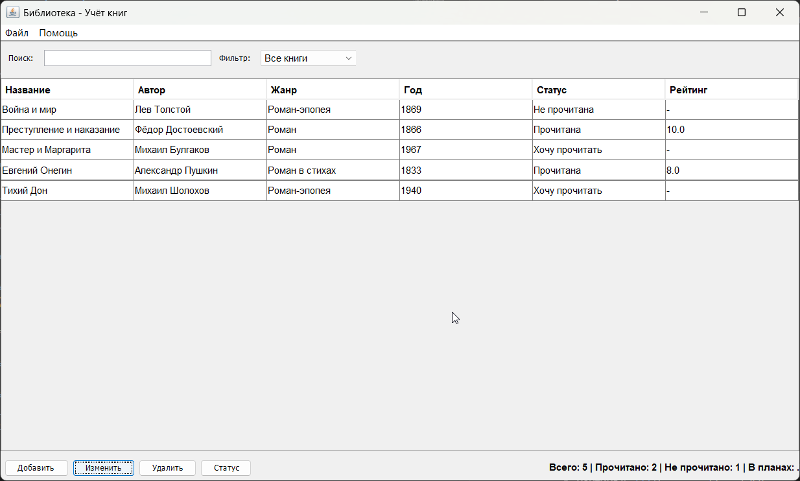
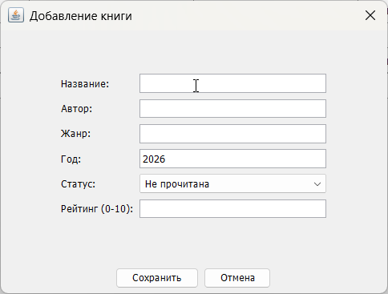
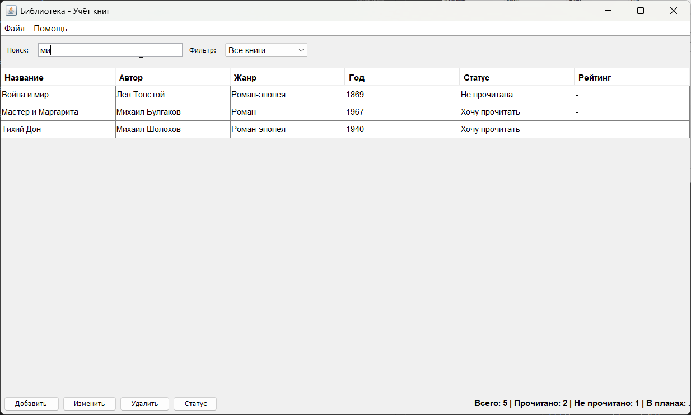
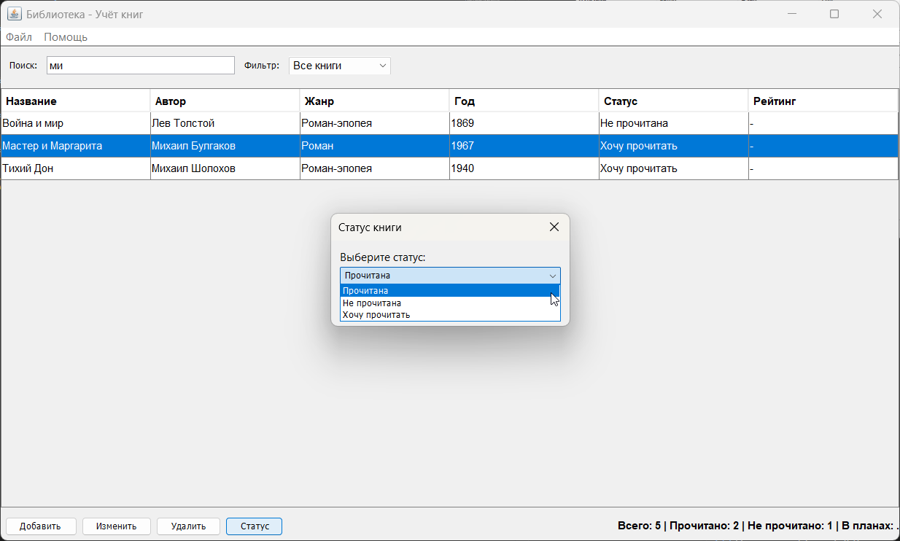
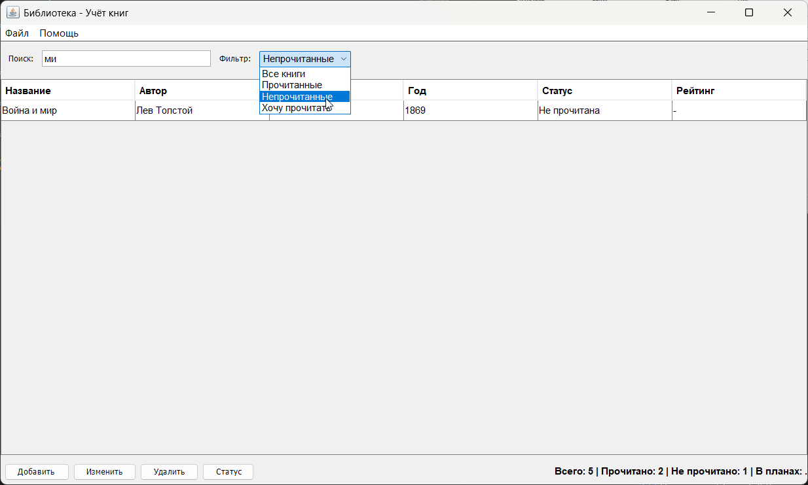
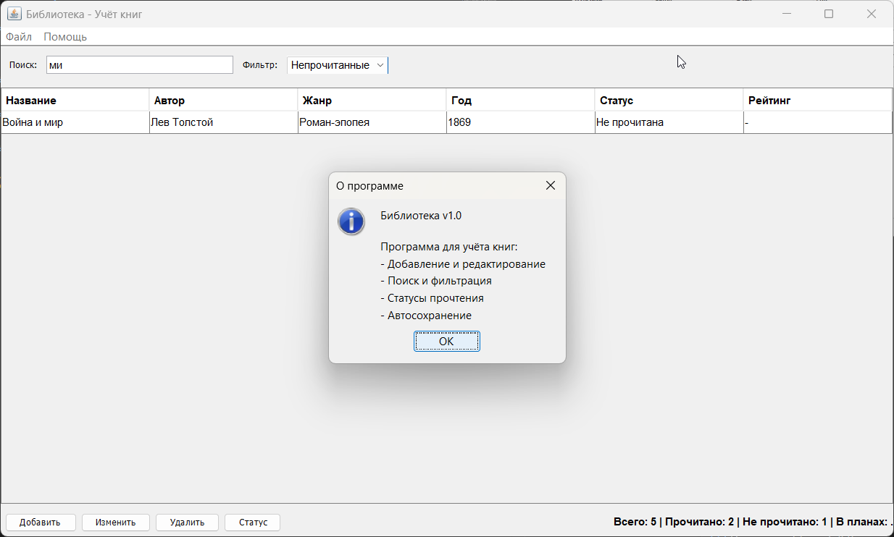
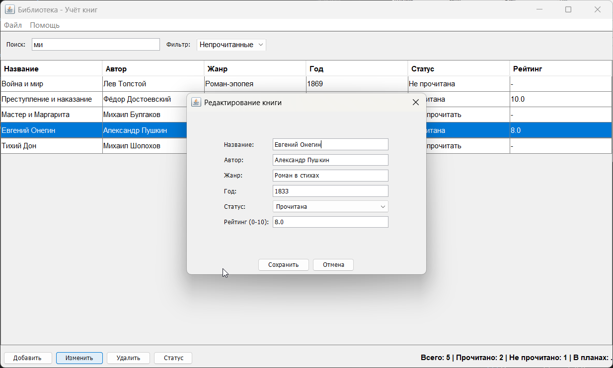

# 📚 Библиотека - Учёт книг

**LibraryManager** — это десктопное приложение на Java Swing для учёта личной библиотеки. Программа позволяет добавлять, редактировать, удалять книги, а также фильтровать их по статусу прочтения.

## ✨ Возможности

- ✅ **Добавление книг** — внесение информации о новых книгах
- ✅ **Редактирование** — изменение данных существующих книг
- ✅ **Удаление** — удаление книг из каталога
- ✅ **Поиск** — поиск по названию или автору
- ✅ **Фильтрация** — фильтр по статусу прочтения:
  - Все книги
  - Прочитанные
  - Непрочитанные
  - Хочу прочитать
- ✅ **Статистика** — отображение количества книг в разных категориях
- ✅ **Сохранение данных** — автоматическое сохранение в файл
- ✅ **Загрузка данных** — загрузка ранее сохранённой библиотеки

## 🛠 Технологии

- **Java 21** — основной язык программирования
- **Swing** — графический интерфейс
- **Maven** — сборка проекта и управление зависимостями
- **Lombok** — упрощение написания классов (геттеры, сеттеры)
- **Serialization** — сохранение данных в файл

## 🚀 Установка и запуск

### Требования
- JDK 21 или выше
- Maven 3.6 или выше

### Запуск из командной строки

1. **Клонировать репозиторий**
   ```bash
   git clone https://github.com/yourusername/library-manager.git
   cd library-manager
   ```

2. **Собрать проект**
   ```bash
   mvn clean compile
   ```

3. **Запустить приложение**
   ```bash
   mvn exec:java -Dexec.mainClass="com.mycompany.librarymanager.LibraryApp"
   ```

### Запуск в IntelliJ IDEA

1. Открыть проект в IntelliJ IDEA
2. Дождаться индексации и загрузки зависимостей
3. Запустить класс `LibraryApp` (Shift+F10)

## 📖 Использование

### Главное окно программы



### Основные действия

#### ➕ Добавление книги
1. Нажмите кнопку **"Добавить"**
2. Заполните поля:
   - Название (обязательно)
   - Автор
   - Жанр
   - Год издания
   - Статус прочтения
   - Рейтинг (0-10)
3. Нажмите **"Сохранить"**

#### ✏️ Редактирование книги
1. Выберите книгу в таблице
2. Нажмите **"Изменить"**
3. Внесите изменения
4. Нажмите **"Сохранить"**

#### 🗑️ Удаление книги
1. Выберите книгу в таблице
2. Нажмите **"Удалить"**
3. Подтвердите удаление

#### 🔄 Изменение статуса
1. Выберите книгу в таблице
2. Нажмите **"Статус"**
3. Выберите новый статус

#### 🔍 Поиск и фильтрация
- Введите текст в поле **"Поиск"** для фильтрации по названию или автору
- Выберите фильтр в выпадающем списке для отображения книг по статусу

#### 💾 Сохранение и загрузка
- **Файл → Сохранить** — сохранить текущую библиотеку
- **Файл → Загрузить** — загрузить ранее сохранённую библиотеку

## 📁 Структура проекта

```
src/main/java/com/mycompany/librarymanager/
├── LibraryApp.java          # Точка входа в приложение
├── MainFrame.java            # Главное окно программы
├── Book.java                 # Модель данных (книга)
└── BookDialog.java           # Диалог добавления/редактирования
```

### Классы

| Класс | Описание |
|-------|----------|
| `LibraryApp` | Запускает приложение (создаёт главное окно в потоке EDT) |
| `MainFrame` | Главное окно с таблицей, панелью инструментов и меню |
| `Book` | Модель данных: поля, конструкторы, геттеры/сеттеры (Lombok) |
| `BookDialog` | Диалоговое окно для добавления/редактирования книги |

### Формат хранения данных

Данные сохраняются в файл `library.dat` в рабочей директории приложения с использованием Java-сериализации.

## 📸 Скриншоты

### Главное окно с книгами


### Диалог добавления книги

### Фильтрация по статусу

### Статистика




